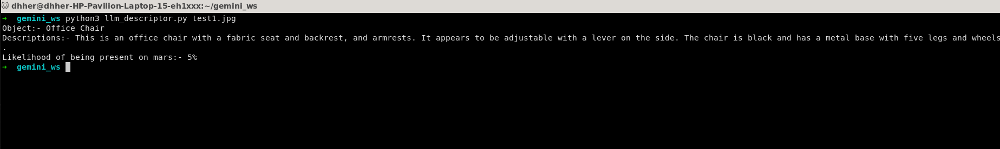
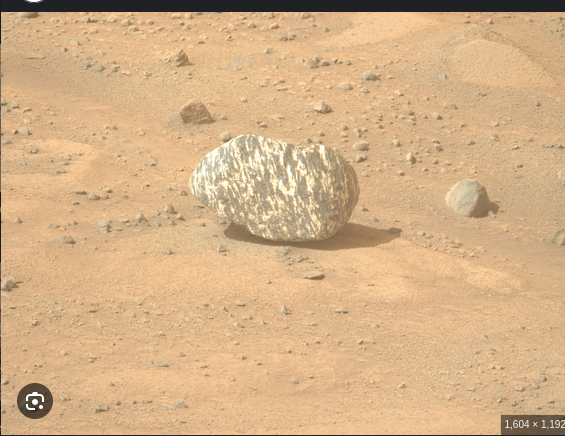
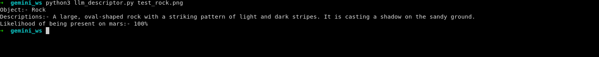
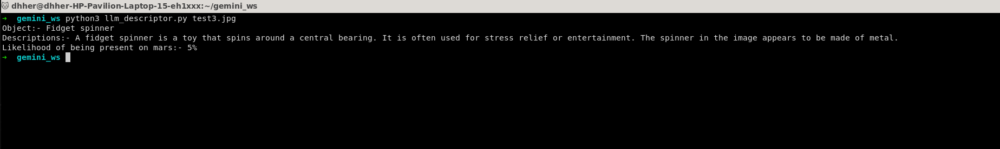

# LLM Descriptor

This repository uses **Google Gemini API** for object descriptions.  
Follow the steps below to set up your environment and get started.  

---

## Prerequisites

- Python 3.8 or later  
- pip (Python package manager)  
- A Google account  

---

## Getting a Gemini API Key

1. Go to the [Google AI Studio](https://aistudio.google.com/).  
2. Sign in with your Google account.  
3. Navigate to the **API Keys** section.  
4. Click **Create API key**.  
5. Copy your new API key.

> **Note:** Make sure your API key is in a `.env` file named as `GEMINI_API_KEY`.

---

## How to Run

```bash
python3 llm_descriptor test1.jpg
```

---

## Example Results

### Example 1

**Input Image:**  


**Result:**  


---

### Example 2

**Input Image:**  


**Result:**  


---

### Example 3

**Input Image:**  


**Result:**  


